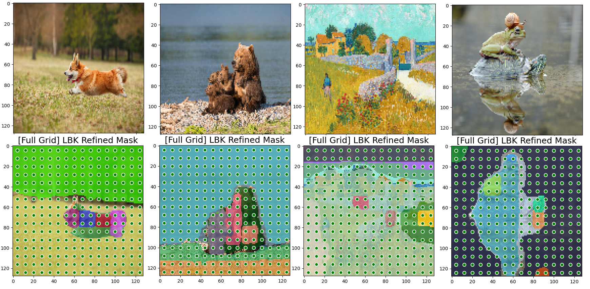
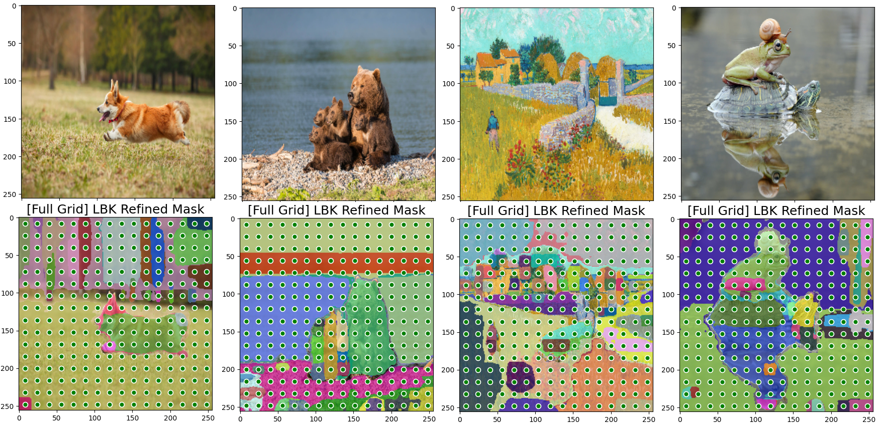
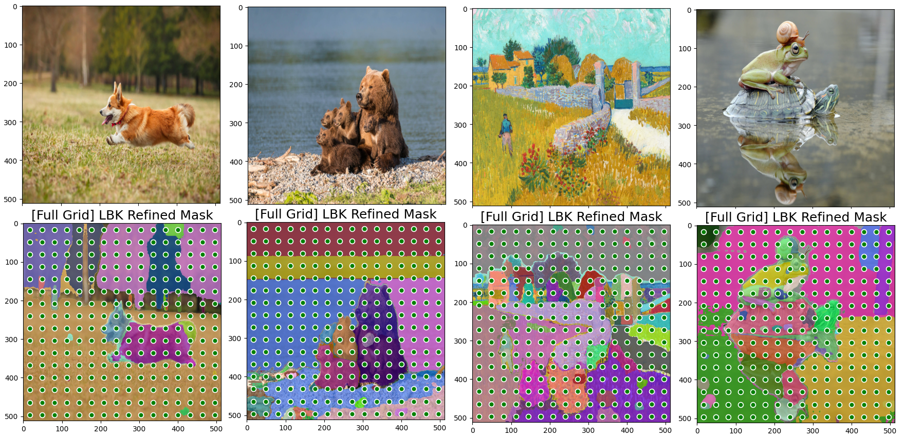
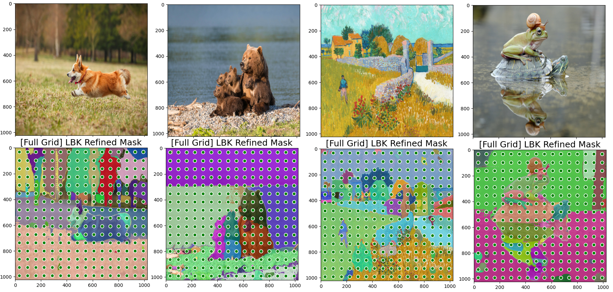

# Full-Segment-Anything


This code is originated from the following Segment Model, where all of the code come from META AI Research, FAIR.


> Affiliation: **[Meta AI Research, FAIR](https://ai.facebook.com/research/)**

> Authors: [Alexander Kirillov](https://alexander-kirillov.github.io/), [Eric Mintun](https://ericmintun.github.io/), [Nikhila Ravi](https://nikhilaravi.com/), [Hanzi Mao](https://hanzimao.me/), Chloe Rolland, Laura Gustafson, [Tete Xiao](https://tetexiao.com), [Spencer Whitehead](https://www.spencerwhitehead.com/), Alex Berg, Wan-Yen Lo, [Piotr Dollar](https://pdollar.github.io/), [Ross Girshick](https://www.rossgirshick.info/)

> Explanation: The **Segment Anything Model (SAM)** produces high quality object masks from input prompts such as points or boxes, and it can be used to generate masks for all objects in an image. It has been trained on a [dataset](https://segment-anything.com/dataset/index.html) of 11 million images and 1.1 billion masks, and has strong zero-shot performance on a variety of segmentation tasks.

---
## Why is Full-Segment-Anything needed?

Segment-Anything code has the following critical issues for doing further research.

* **Cannot conduct batch-input on the full-grid prompt (automatic mask generation)**

* **Can batch-input on the small number of prompts, Excluding post-processing: removing duplicated or small regions and holes.**

* **Non-flexible input image size (Fixed resolution of **1024**)**

Therefore, Full-Segment-Anything addresses the above issues:

* **Can conduct batch-input on the full-grid prompt (automatic mask generation)**

* **Can batch-input on the small number of prompts, Including post-processing: removing duplicated or small regions and holes.**

* **Flexible input image size (***128, 256, 512, 1024, etc***)**

(Not did we re-train, but we modified in the code-level)

---
## Visualization of Full-Segment-Anything

<figure class="half1">
<figcaption>
Figure 1. Full-Segment-Anything on Image Resolution *128*
</figcaption>



<figcaption>
Figure 2. Full-Segment-Anything on Image Resolution *256*
</figcaption>


<figcaption>
Figure 3. Full-Segment-Anything on Image Resolution *512*
</figcaption>



<figcaption>
Figure 4. Full-Segment-Anything on Image Resolution *1024*
</figcaption>


<figure>

## How to use Full-Segment-Anything?

In example.py, there is part of Example 6.

You can consider this part and modify it to fit your individual purpose.

If you want to the changed part in record, compared by origincal SAM code, you can search keyword of "by LBK EDIT" or "LBK", of which position represents the code-changed position in detail. 

(Example 1-5 conduct trial and errors to investigate what the problems of oiriginal SAM code are.)

```python
""" Example 6: [LBK SAM] Batched Inputs -> **Full Grid Prompts** -> Multiple Mask Generation with filtering small and dulicated regions or holes [Very Hard] """
import numpy as np
from PIL import Image
import torch
import torchvision

from mask_generator import SamMaskGenerator
import matplotlib.pyplot as plt
from utils.utils import show_mask, show_points, show_lbk_masks

from build_sam import sam_model_registry


# img resolution
img_resolution = 256
sam = sam_model_registry['vit_b'](checkpoint='ckpt/sam_vit_b_01ec64.pth', custom_img_size=img_resolution).cuda()

# prompt
from utils.amg import build_all_layer_point_grids
input_point = torch.as_tensor(build_all_layer_point_grids(16, 0, 1)[0] * img_resolution, dtype=torch.int64).cuda()
input_label = torch.tensor([1 for _ in range(input_point.shape[0])]).cuda()

def prepare_image(image, img_resolution=img_resolution):
    trans = torchvision.transforms.Compose([torchvision.transforms.Resize((img_resolution, img_resolution))])
    image = torch.as_tensor(image).cuda()
    return trans(image.permute(2, 0, 1))

# image upload
img1 = np.array(Image.open("figure/sam1.png"))[...,:3]
img2 = np.array(Image.open("figure/sam2.png"))[...,:3]
img3 = np.array(Image.open("figure/sam3.png"))[...,:3]
img4 = np.array(Image.open("figure/sam4.png"))[...,:3]
img1_tensor = prepare_image(img1)
img2_tensor = prepare_image(img2)
img3_tensor = prepare_image(img3)
img4_tensor = prepare_image(img4)
plt.figure(figsize=(5,5))
plt.imshow(img1_tensor.permute(1,2,0).cpu().numpy())
plt.axis('on')
plt.show()
plt.figure(figsize=(5,5))
plt.imshow(img2_tensor.permute(1,2,0).cpu().numpy())
plt.axis('on')
plt.show()
plt.figure(figsize=(5,5))
plt.imshow(img3_tensor.permute(1,2,0).cpu().numpy())
plt.axis('on')
plt.show()
plt.figure(figsize=(5,5))
plt.imshow(img4_tensor.permute(1,2,0).cpu().numpy())
plt.axis('on')
plt.show()

# batchify
batched_input = [
     {
         'image': x,
         'point_coords': input_point,
         'point_labels': input_label,
         'original_size': x.shape[1:]
     } for x in [img1_tensor, img2_tensor, img3_tensor, img4_tensor]
]

# LBK propagation
refined_masks = sam.individual_forward(batched_input, multimask_output=True)

# image mask generation visualization
plt.figure(figsize=(5,5))
plt.imshow(img1_tensor.permute(1,2,0).cpu().numpy())
show_lbk_masks(refined_masks[0].cpu().numpy(), plt)
show_points(input_point.cpu().numpy(), input_label.cpu().numpy(), plt.gca())
plt.title(f"[Full Grid] LBK Refined Mask", fontsize=18)
plt.axis('on')
plt.show()


plt.figure(figsize=(5,5))
plt.imshow(img2_tensor.permute(1,2,0).cpu().numpy())
show_lbk_masks(refined_masks[1].cpu().numpy(), plt)
show_points(input_point.cpu().numpy(), input_label.cpu().numpy(), plt.gca())
plt.title(f"[Full Grid] LBK Refined Mask", fontsize=18)
plt.axis('on')
plt.show()

plt.figure(figsize=(5,5))
plt.imshow(img3_tensor.permute(1,2,0).cpu().numpy())
show_lbk_masks(refined_masks[2].cpu().numpy(), plt)
show_points(input_point.cpu().numpy(), input_label.cpu().numpy(), plt.gca())
plt.title(f"[Full Grid] LBK Refined Mask", fontsize=18)
plt.axis('on')
plt.show()


plt.figure(figsize=(5,5))
plt.imshow(img4_tensor.permute(1,2,0).cpu().numpy())
show_lbk_masks(refined_masks[3].cpu().numpy(), plt)
show_points(input_point.cpu().numpy(), input_label.cpu().numpy(), plt.gca())
plt.title(f"[Full Grid] LBK Refined Mask", fontsize=18)
plt.axis('on')
plt.show()
```